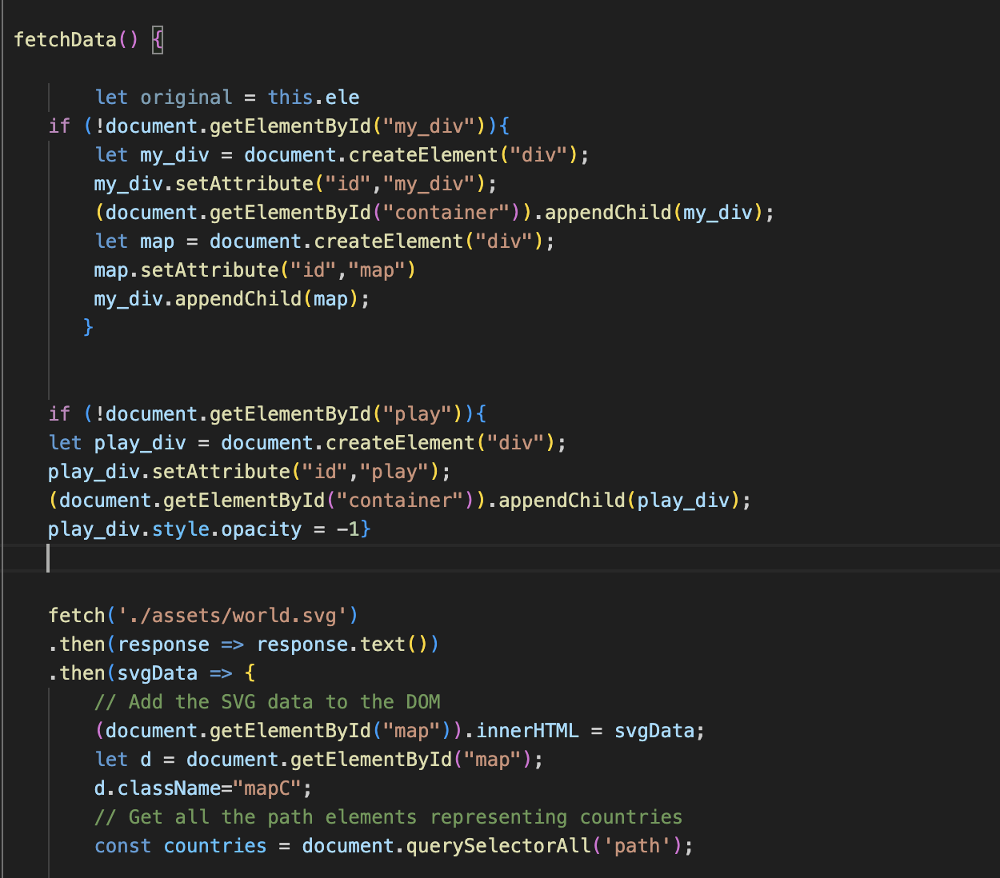
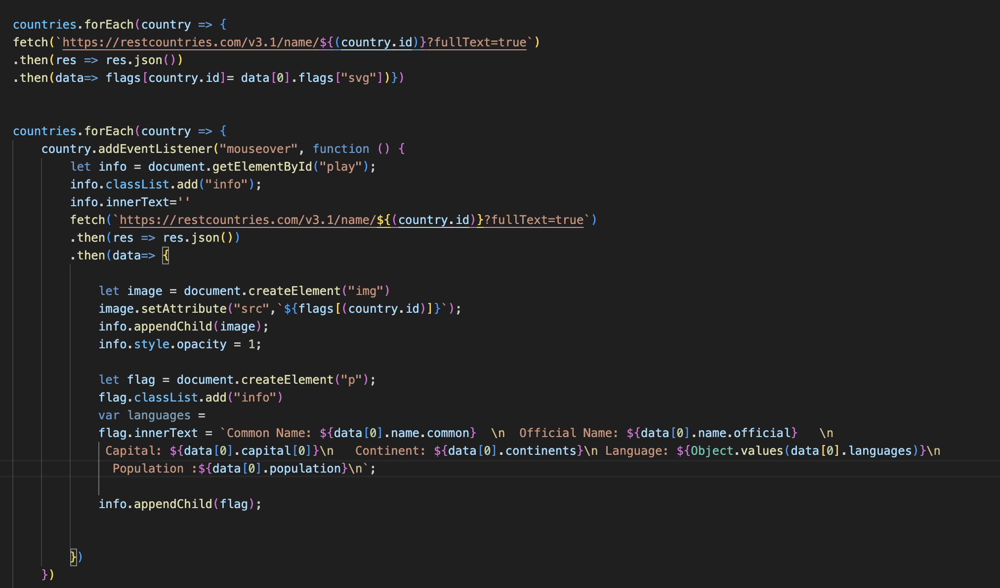

<h1>Flag Frenzy</h1>

<h2>Background: </h2>

Flag Frenzy is a game that allows the user to learn and test his knowledge on geography, specifically to learn the flags of each country. First, Flag Frenzy gives the user the choice either to start playing or select the guide that would allow him to check information about each country. 

The game has a timer and score to evaluate user's performance

<h2>Functionality & MVPs:</h2>

In <b>Flag Frenzy</b>, users will be able to:

<ul>
<li>Navigate between learning mode and game</li>
<li>Select any country in the world map to check its information</li>

<li>Choose  </li>
<li>Drag each flag on the country in the map.</li>
<li>Choose the continent to play on</li>
<li>Cover a country with a flag to keep track of the correct answers </li>

<li> See his performances </li>

</ul>

<h2> Libraries and APIs: </h2>
<ul>
<li> SVGMap </li>
<li> REST API <a href="https://restcountries.com/v3.1/all"> https://restcountries.com/v3.1/all </a> </li>
<li> FlagsAPI  https://flagsapi.com/ </li>
<li> SweetAlert library </li>
<li> Webpack to bundle and transpile the source JavaScript code</li>
<li> npm to manage project dependencies.</li>
</ul>

<h2>Implementation Timeline:</h2>

<ul>
<li> Friday Afternoon & Weekend: Setup project, getting webpack up and running. Ensure that my data is being fetched properly and displaying the map</li>

<li>Monday: Create a svg's for each continent using the world map. Create continents classes and implement the logic of the game. Fetch flags from flagsAPI.</li>

<li>Tuesday: Fetch more information about countries using RestAPI and create the Guide country class </li>

<li>Wednesday: Focus on styling, and covering the countries with corresponding Flag. Add timer and score.</li>

<li>Thursday Morning: Deploy to GitHub pages.</li>

</ul>

<h2>Future Implementations:</h2>
<ul>
    <li> Add more informations to the country Guide</li>
    <li> Add capitals, language games </li>
    <li> Add a quizz part</li>
</ul>
